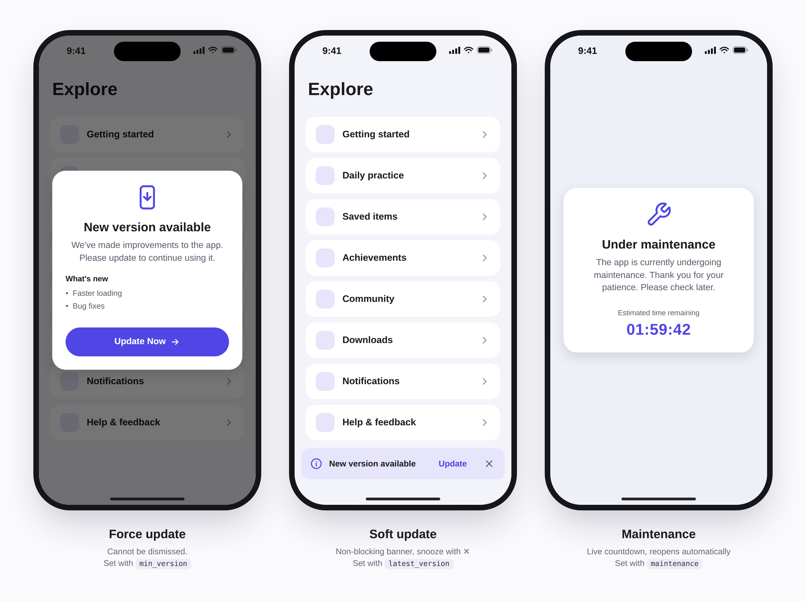
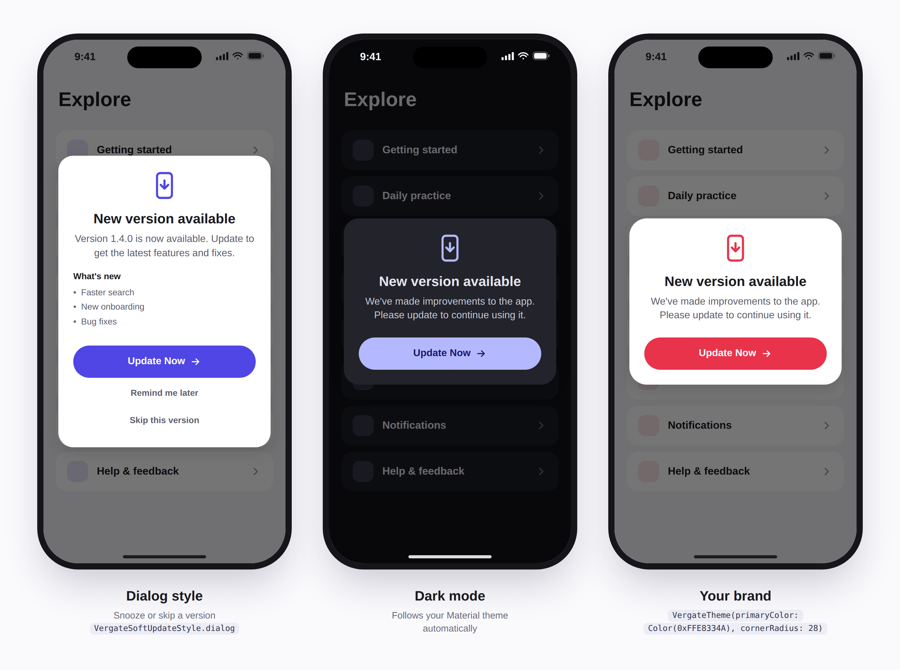

# Vergate

[](https://pub.dev/packages/vergate)
[](LICENSE)

**A gate in front of your app.** Vergate decides whether the installed version
of your Flutter app may run: force an update, suggest an optional one, or show
a maintenance screen. It works with any backend, and you control every pixel.

<p align="center">
  
</p>

## Features

- **Force update**: a dialog that cannot be dismissed, driven by `min_version`.
- **Soft update**: a non-blocking banner or dialog, driven by `latest_version`.
- **Remind me later** and **Skip this version**: remembered between launches.
- **Maintenance mode**: optional `from` / `until` window, live countdown, and
  automatic re-check when the window ends.
- **Per-platform rules**: separate versions and store links for Android and iOS.
- **Release notes** shown in the update dialog.
- **Bring your own backend**: JSON URL, Firebase Remote Config, Supabase,
  the App Store lookup, or your own code. No Firebase dependency.
- **Fail-open**: network or parsing errors never lock the user out.
- **Re-checks on app resume**: users who return from the store are let in at once.
- **Fully customizable**: theme, localized texts, or replace any screen with
  your own widget.
- **UI-free core**: use only `VergateController` and build your own UI if you like.

<p align="center">
  
</p>

## Installation

```yaml
dependencies:
  vergate: ^0.1.0
```

```bash
flutter pub get
```

## Quick start

**1. Create a controller and start it in `main()`.**

```dart
import 'package:flutter/material.dart';
import 'package:vergate/vergate.dart';

final vergate = VergateController(
  source: JsonUrlSource(Uri.parse('https://example.com/app-version.json')),
);

void main() {
  WidgetsFlutterBinding.ensureInitialized();
  vergate.start(); // Not awaited: the app opens immediately.
  runApp(const MyApp());
}
```

**2. Wrap your app with `VergateGate`.**

```dart
class MyApp extends StatelessWidget {
  const MyApp({super.key});

  @override
  Widget build(BuildContext context) {
    return MaterialApp(
      builder: (context, child) => VergateGate(
        controller: vergate,
        child: child!,
      ),
      home: const HomePage(),
    );
  }
}
```

**3. Publish a config.** Host this JSON anywhere (or store it in Remote Config):

```json
{
  "android": {
    "min_version": "1.2.0",
    "latest_version": "1.4.0",
    "store_url": "https://play.google.com/store/apps/details?id=com.example.app"
  },
  "ios": {
    "min_version": "1.2.0",
    "latest_version": "1.4.0",
    "store_url": "https://apps.apple.com/app/id123456789"
  },
  "release_notes": ["Faster loading", "Bug fixes"],
  "maintenance": {
    "enabled": false
  }
}
```

That is all. Change the JSON and your users see the new behavior.

## How the status is decided

The first matching rule wins:

| # | Condition | Status | User experience |
|---|-----------|--------|-----------------|
| 1 | Maintenance is enabled and now is inside `from` / `until` | `VergateUnderMaintenance` | Full-screen page, cannot be dismissed |
| 2 | Installed version `<` `min_version` | `VergateForceUpdate` | Dialog, cannot be dismissed |
| 3 | Installed version `<` `latest_version` | `VergateSoftUpdate` | Banner or dialog, can be dismissed |
| 4 | Otherwise | `VergateUpToDate` | Nothing is shown |

A platform without rules (for example `ios` missing from the JSON, or web and
desktop) is never blocked.

## Config reference

| Key | Type | Description |
|-----|------|-------------|
| `android` / `ios` | object | Rules for that platform |
| `<platform>.min_version` | string | Older versions must update |
| `<platform>.latest_version` | string | Older versions are offered an update |
| `<platform>.store_url` | string | Opened by the update button |
| `release_notes` | string list | Bullets shown in the update dialog |
| `maintenance.enabled` | bool | Master switch |
| `maintenance.from` | ISO 8601 | Optional start. Missing means "already started" |
| `maintenance.until` | ISO 8601 | Optional end. Missing means "until further notice" |
| `maintenance.message` | string | Optional text for the maintenance screen |

Tips:

- Versions accept `1`, `1.2`, `1.2.3`, `v1.2.3` and `1.2.3+45`. A pre-release
  tag such as `-beta.1` is ignored.
- The installed build number is part of the comparison. Writing `"1.4.0"`
  never triggers an update because of a build number. Write `"1.4.0+10"` to
  target a specific build.
- Always include a time zone in dates, for example `2026-10-01T22:00:00Z`.
  Dates without a zone are read as the device's local time.
- Invalid values are ignored instead of crashing your app.

## Data sources

A source is anything that returns a `VergateConfig`. Pick one, or combine them.

### JSON over HTTP

Works with your own backend, GitHub raw files, S3, Cloudflare R2 and so on.

```dart
JsonUrlSource(
  Uri.parse('https://api.example.com/app-version'),
  headers: {'Authorization': 'Bearer $token'},
  timeout: const Duration(seconds: 8),
)
```

### Firebase Remote Config

Vergate has no Firebase dependency. Store the whole JSON in one string
parameter (here `vergate_config`) and connect it with `CallbackSource`:

```dart
final remoteConfigSource = CallbackSource(() async {
  final rc = FirebaseRemoteConfig.instance;
  await rc.setConfigSettings(RemoteConfigSettings(
    fetchTimeout: const Duration(seconds: 10),
    minimumFetchInterval: kDebugMode ? Duration.zero : const Duration(hours: 1),
  ));
  await rc.setDefaults({'vergate_config': '{}'});
  await rc.fetchAndActivate();
  return VergateConfig.fromJsonString(rc.getString('vergate_config'));
});
```

> Remote Config caches values for 12 hours by default. If a change in the
> console does not show up, lower `minimumFetchInterval` as above.

### App Store lookup (iOS, no backend)

Reads the newest published version from the App Store. It provides
`latest_version`, the store link and release notes, so it produces **soft
updates only**.

```dart
ItunesLookupSource(bundleId: 'com.example.app', country: 'us')
```

Set `country` to your store's two-letter code if the app is not sold in the US.

### Fallback chain

Tries sources in order and uses the first one that succeeds:

```dart
FallbackSource([
  JsonUrlSource(Uri.parse('https://api.example.com/app-version')),
  remoteConfigSource,
])
```

### Your own source

```dart
class MySource implements VergateSource {
  @override
  Future<VergateConfig> fetch() async {
    // Load from anywhere, then return a VergateConfig.
  }
}
```

## Soft update styles

```dart
VergateGate(
  controller: vergate,
  softUpdateStyle: VergateSoftUpdateStyle.banner, // banner | dialog | none
  bannerAlignment: Alignment.bottomCenter,
  child: child!,
)
```

- `banner` (default): a floating banner. The close button snoozes the update.
- `dialog`: shows **Update Now**, **Remind me later** and **Skip this version**.
- `none`: shows nothing; read `vergate.status` and build your own UI.

The banner floats above your app. With the default `Alignment.topCenter` it
covers the top of your screen, so many apps prefer
`Alignment.bottomCenter`, as in the screenshots above.

**Snooze** hides a soft update for `snoozeDuration` (24 hours by default).
**Skip** hides one specific version; a newer version shows up again.
Force updates and maintenance are never hidden.

## Customization

### Theme

Every value is optional. Missing ones come from your `MaterialApp` theme, so
dark mode works out of the box.

```dart
VergateGate(
  controller: vergate,
  theme: const VergateTheme(
    primaryColor: Color(0xFFE8334A),
    cornerRadius: 28,
    buttonRadius: 100,
    maxWidth: 380,
    updateIcon: FlutterLogo(size: 48), // your own logo
  ),
  child: child!,
)
```

`VergateTheme` also exposes colors for surfaces, text, banner and barrier, the
title / message / button text styles, card padding and the animation duration.

### Texts and localization

All texts default to English. Override any of them:

```dart
VergateGate(
  controller: vergate,
  strings: const VergateStrings(
    updateTitle: 'إصدار جديد متاح',
    updateNow: 'حدّث الآن',
  ),
  child: child!,
)
```

For a localized app, build the texts from your own localization system
(`gen_l10n`, `easy_localization`, `intl` and so on):

```dart
VergateGate(
  controller: vergate,
  stringsBuilder: (context) => VergateStrings(
    updateTitle: AppLocalizations.of(context).updateTitle,
    updateNow: AppLocalizations.of(context).updateNow,
  ),
  child: child!,
)
```

Use either `strings` or `stringsBuilder`, not both. In
`softUpdateMessage` and `forceUpdateMessage`, `{version}` is replaced with the
latest version number. Right-to-left languages follow your app's
`Directionality`.

### Replace a screen completely

Build your own widget for any state. You get the status and the controller:

```dart
VergateGate(
  controller: vergate,
  forceUpdateBuilder: (context, status, controller) => MyForceUpdatePage(
    notes: status.releaseNotes,
    onUpdate: controller.openStore,
  ),
  maintenanceBuilder: (context, status, controller) => MyMaintenancePage(
    message: status.maintenance.message,
  ),
  child: child!,
)
```

There is also `softUpdateBuilder`. The returned widget fills the whole screen.

### Analytics callbacks

```dart
VergateGate(
  controller: vergate,
  onUpdateTap: (status) => analytics.log('update_tap'),
  onLaterTap: (status) => analytics.log('update_later'),
  onSkipTap: (status) => analytics.log('update_skip'),
  child: child!,
)
```

## Use the controller without any UI

`VergateController` is a `ChangeNotifier`. Skip `VergateGate` and react to it:

```dart
ListenableBuilder(
  listenable: vergate,
  builder: (context, _) => switch (vergate.status) {
    VergateUpToDate() => const HomePage(),
    VergateSoftUpdate() => const HomePage(),
    VergateForceUpdate() => const MyForceUpdateScreen(),
    VergateUnderMaintenance() => const MyMaintenanceScreen(),
  },
);
```

Controller options and members:

| Member | Description |
|--------|-------------|
| `source` | Where the config comes from (required) |
| `snoozeDuration` | How long "Remind me later" hides a soft update. Default 24 h |
| `resumeCheckInterval` | Minimum time between resume-triggered fetches. Default 15 min. Ignored while a force update or maintenance is shown |
| `onError` | Called when a check fails (log to Crashlytics or Sentry) |
| `storage` | Where snooze and skip are saved. Default `shared_preferences`. Use `MemoryStorage()` to not persist |
| `start()` | Runs the first check and watches app lifecycle |
| `check()` | Fetches again now. Never throws |
| `status` | Current `VergateStatus` |
| `snooze()` / `skipVersion()` / `resetUserChoices()` | Manage the user's choices |
| `openStore()` | Opens the store page. Returns `false` if it could not |
| `currentVersion`, `config`, `lastError`, `isChecking` | Extra state |

Call `vergate.dispose()` if you create a controller that is shorter-lived than
your app.

## Testing your UI

In debug mode you can force any status, no backend needed:

```dart
vergate.debugOverrideStatus(
  const VergateUnderMaintenance(VergateMaintenance(enabled: true)),
);

vergate.debugOverrideStatus(null); // back to the real status
```

This does nothing in release builds.

## FAQ

**Does it work without a backend?**
Yes, for soft updates on iOS: use `ItunesLookupSource`. For force updates you
need somewhere to store `min_version`; Remote Config or a static JSON file on
GitHub is enough.

**Why is there no Play Store lookup for Android?**
Google Play offers no official API for reading the public version, and
scraping the store page breaks without warning. Store the Android version in
your own config instead.

**What if the user is offline?**
Vergate fails open. The user is never blocked because a check failed, and a
previously loaded status is kept.

**Can a user bypass a force update with the Android back button?**
The gate is not a route, so back may leave the app, but the app underneath is
blocked for touch, focus and screen readers while the gate is shown. Remember
that a client-side gate cannot replace server-side version checks for
security-critical APIs.

**Is state lost when the overlay appears?**
No. Your app stays mounted underneath the overlay.

## Contributing

Issues and pull requests are welcome at the
[issue tracker](https://github.com/YOUR_USERNAME/vergate/issues).

## License

MIT. See [LICENSE](LICENSE).